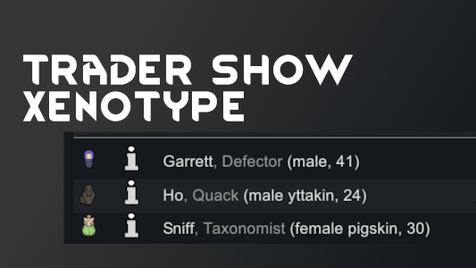

# Trader Show Xenotype 

A RimWorld mod that shows xenotype next to age for non-baseliner pawns in trade menus.

Find it [here](https://steamcommunity.com/sharedfiles/filedetails/?id=3007612546) on the Steam workshop.
